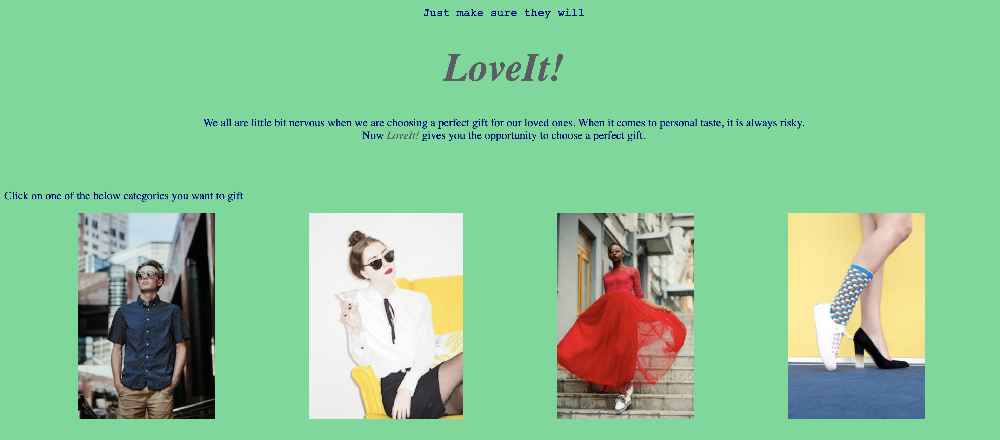
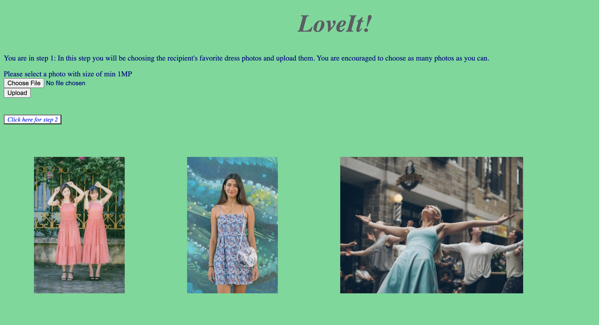
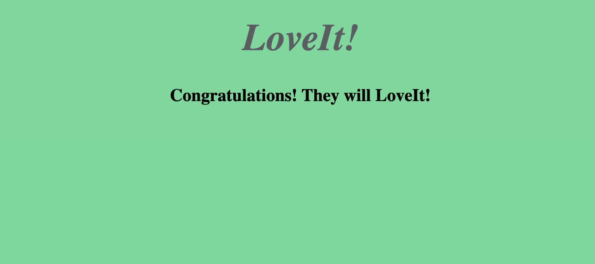

  

##### LoveIt! is a user friendly image classification platform that helps people to choose the perfect gift for their loved ones!
---

## Problem Statement
For most of us, looking for a perfect gift is not a fun process. Sometimes we have an idea of the perfect gift; but that gift turns out to not be a good one. In a lot of cases, we are not sure if our loved ones will like the gift we give them. This stress is not only on the giver; but also on the recipient. They may be stuck between politely stating that they did not like the gift, and pretending to like it.  
LoveIt! is designed to solve this problem and takes the stress out of gift giving. LoveIt! helps users choose a gift that their loved ones will appreciate. LoveIt ensures that their gift will be sentimental and useful. It makes gift searching fun.

---
## Executive Summary
LoveIt! uses Convolutional Neural Network to classify images. An html based platform and Flask are used to create the project. In this platform, there are few clothing and shoes categories. The giver chooses the category of the gift, and uploads the recipient's favorite and the least favorite item photos into the system. Each of the photos are saved in different folders when they are uploaded. CNN model learns the recipient's taste by analyzing those photos. In the final step, the giver uploads a photo of a particular item that may be a candidate for a gift. Based on the training input, LoveIt! tells the user whether it is a good gift or not. Our goal is to inform givers about the gift matches with recipient's taste. 
The data, which consists of the photos of favorite items, disliked items, and a gift photo, was provided by users. The CNN model is a categorical classification model and it uses accuracy and categorical crossentropy metrics. I found that the number of input and testing accuracy are highly correlated. When we increase the number of "favorite item photos" and "least favorite item photos", the accuracy increases as well. This situation may cause an issue for the users that do not have many photos to train the model. 

--- 
## Methodology & Analysis

In order to analyze visual imagery, I chose to use convolutional neural network. Below Python and neural network libraries wre used in the project.
- [Tensorflow](https://www.tensorflow.org/): Tensorflow and Keras were used to create a Sequential model and implement the layers and regularizations
- [Scikit-Learn](https://scikit-learn.org/): GridSearchCV to find the best parameters
- [Matplotlib](https://matplotlib.org/): img method was used to extract photo digital data and plt method was used for data visualizations
- [OpenCV](https://opencv.org/): cv2 package was used to resize the data.  

Besides the above specfic packages, Pandas, Numpy, Python Image Library were also used.  
In order to initially train the model, I used different photos which were obtained from shopping websites, such as macys.com and shop.nordstorm.com. In the first step, I cleaned and prepared the training and testing data. Since the model takes image data, I used .matplotlib.image library to get the image data, and .cv2 library to resize the images.

### Data cleaning

I started the data cleaning step by extracting the digital image data from the downloaded photos. I used matplotlib's image library .imread package for this process. This imports the image data into a numpy array. Once I have the image data in a numpy array, I converted it to float datatype; otherwise I would get an error. In an image data, each pixel has a value between 0 and 255. I divided the each data by 255 in order to scale between 0 and 1 (normalizing). After I normalized the data, I resized them as 780x1196 pixel. This makes each photo to close to 1MP which is good enough size for a quality decision. I used OpenCV library cv2 package to resize them. I combined all of the liked and disliked item photo data in a numpy array. This prepared the images to be processed in the model. Each image has a corresponding target value. They are either liked or disliked (favorite or unfavorite). I used another numpy array to store the corresponding value for each photo. The model will process the image data and the target value together. For this purpose, the liked photos were labeled as 1, while disliked ones were labeled as 0. 
Those 2 numpy arrays were enough to train the model. For predictions, I needed testing photos. These testing photos are the photos of the potential gift items. The user will upload the potential gift photo in order to receive the prediction. That's the reason why my data cleaning included the preparation of those test photos. For each photo, I extracted the image data, divided it by 255 and resized it as 780x1196 pixel. 

### Modeling

Convolutional neural network model has many hyperparameters to tune in. With Scikit-Learn's GridSearchCV( ), I tried different combinations of many hyperparameters. The number of convolutional layers and filter numbers in each layer were tuned in. As I increased the number of convolutional layers, the complexity has increased. Also, I tried lasso and ridge regularization tecniques, as well as dropout and early stopping techniques. I also tried to tweak number of dense layers, nodes, epochs and batch size. Due to complexity of the model and number of combinations, I did not put all of the hyperparameters in one gridsearch.
In order to find the optimal hyperparameter combinations, I considered "time", "accuracy", "computational power" and "loss" as decision criteria. Based on these, I decided to use 4 convolutional layers, and 3 dense layers in my sequential model. The convolutional layers have 8, 16, 32, and 64 filters. The dense layers have 32 filters. Also, I used dropout regularization methods after each dense layers.  
One of the interesting findings in the modeling stage is that the model accuracy came out better when I use multi-class categorical model instead binary class categorical model. This was defined by the number of output layers. When I used 1 node in the output layer, this means the model is a binary class. When I used 2 nodes in the output layer, this means the model is a multi-class categorical model. Multi-class categorical model requires 'softmax' activation function in the output layer. Binary class model requires 'sigmoid' activation function in the output layer. After I created the model, I saved it in order to use it later. Among all of the models we trained, we reached to 86% accuracy in our best model.

### User interface
In the user interface part, I designed an html based webpage using Flask library. This webpage is locally hosted. In total 18 html templates were embedded to Flask. The main page included the links for 4 different gift category. I created 4 routes for these categories.
Typically, for each category there are 3 steps.



- Step 1 : The giver (user) uploads the "liked" item photos. These are the items that recipient likes or owns.  
  
- Step 2: The giver uploads the "disliked" item photos. These are the items that recipient dislikes.
- Step 3 : The giver uploads a photo of a particular item that may be a candidate for a gift. After they upload this, model runs and returns the decision.
    
In the step 1, the 'liked' item photos are stored in a folder separately for each category. The giver uses the 'upload' button to upload each photos. Before this stage all the photos must be ready to upload. In the step 2, similar to step 1, each 'disliked' item photo is stored in a folder. For step 3, where the giver uploads the candidate gift photo, the saved model is loaded in Flask. Model uses the saved photos to trains and makes prediction. Before the candidate photo is processed in the model, it is resized and reshaped and then put into the model.    
Even though each category uses the same model, the data storing files are different for each category. That is why I created different categories.

---
## Future Developments

I am going to improve the project in several aspects before deployment. These are mostly regarding to user experiences.
First, I would like to make photo uploading process easier than current way. Currently the user uploads the photo with 'upload' button. This tool does not allow users to upload more than 1 photo at a time. Instead of using upload button, I can use a drag-drop tool. This can make the webpage more user friendly. Also, each user can create their own account with a secure username and password. Therefore they can save all the liked and disliked photos for each recipient. For example, Person A can have an account that can store her boyfriend's and her mother's liked or disliked item photos. With this feature Person A does not need to upload new set of photos everytime she uses the platform. **With a browser extension, user can add photos to the system while she is browsing on the internet.** When she sees an item photo that the recipient may like, she added into her account immediately.   
Another exciting development could be a mobile application. With the mobile application, giver can add photos, by taking photos on the spot.  
Currently, there are 4 product categories. I need to add more categories before the deployment. 

---
## Conclusions

I concluded that the accuracy of the model is primarily dependent on the number images that were used to train the model. Regarless of the hyperparamateres, when we fit the model with less than 40 images (both liked and disliked items), I could not exceed the 70% accuracy. I have better results with 40+ images. That's the reason why we have to make sure that the users upload at least 40 photos.
Another finding is that, when we use binary class dense layer, (1 dense layer with 'sigmoid' activation function) the accuracy is also lower than 50%. When we change the number of dense layer to 2 and use 'softmax' activation function, the accuracy rate increased over 50%. This is quite interesting because, the actual business problem is a binary classification problem.
Since this is a practical and fun project, I have to emphasize that the model is trying to imitate a person's taste. Usually, it is a difficult process to formulate a person's taste. Our model uses similarity between images to decide whether it is a good gift or not. As people's taste evolve, so to will LoveIt!'s ability to predict their good taste.


## Project Directory
```
LoveIt
|__ code
|   |__ 01_gridsearch.ipynb
|   |__ 02_machine_3.ipynb
|__ machine_3
|   |__ assets
|   |__ saved_model.pb
|   |__ variables
|       |__ variables.data-00000-of-00001
|       |__ variable.index
|__ static
|   |__ hp
|   |__ men_shirts
|   |__ musical_summaries.csv
|   |__ new_files
|       |__ men_shirts_check
|       |__ men_shirts_disliked
|       |__ men_shirts_liked
|       |__ shoes_check
|       |__ shoes_disliked
|       |__ shoes_liked
|       |__ women_dress_check
|       |__ women_dress_disliked
|       |__ women_dress_liked
|       |__ women_shirts_check
|       |__ women_shirts_disliked
|       |__ women_shirts_liked
|   |__ shoes
|   |__ women_dress
|   |__ women_shirts
|__ test
|__ train
|__ templates
|   |__ form_men_shirts_check.html
|   |__ form_men_shirts_disliked.html
|   |__ form_men_shirts_hp.html
|   |__ form_men_shirts_liked.html
|   |__ form_shoes_check.html
|   |__ form_shoes_disliked.html
|   |__ form_shoes_hp.html
|   |__ form_shoes_liked.html
|   |__ form_women_dress_check.html
|   |__ form_women_dress_disliked.html
|   |__ form_women_dress_hp.html
|   |__ form_women_dress_liked.html
|   |__ form_women_shirts_check.html
|   |__ form_women_shirts_disliked.html
|   |__ form_women_shirts_hp.html
|   |__ form_women_shirts_liked.html
|   |__ homepage.html
|   |__ results.html
|__ loveit.py
|__ presentation.pdf
|__ .ipynb_checkpoints
|__ assets
|__ README.md
```
